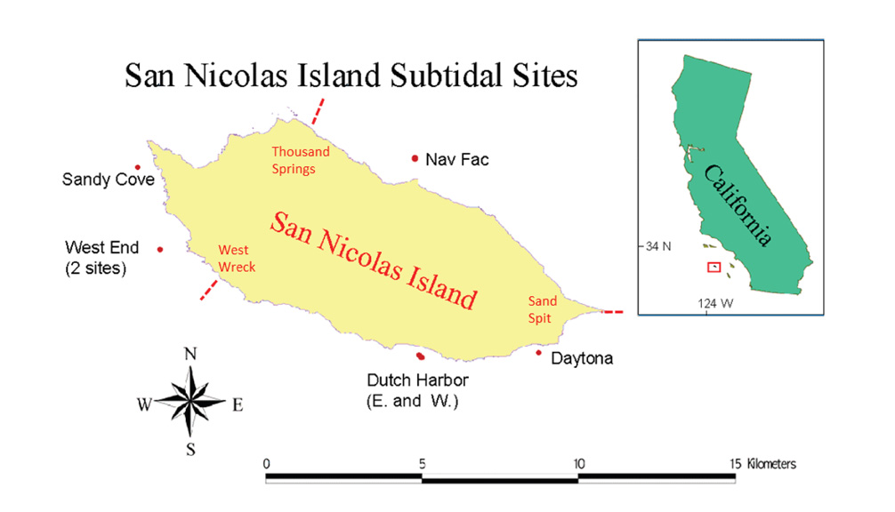
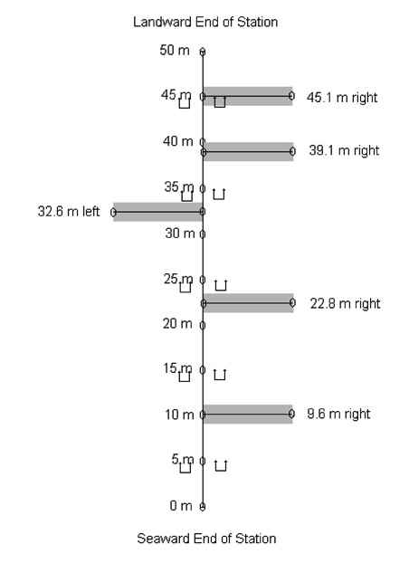

### 1. Introduction
This project will use data from a long-term monitoring project at San Nicolas Island (SNI) to investigate dynamic interactions and predictability between kelp forest brown algae species (*Macrocystis pyrifera* and understory kelps), and various species of invertebrates.  We will see how well these species can predict each other's dynamics, and resolve competitive, mutualistic, and herbivorous species interactions across the timeframe of the dataset.  The species we will look at are:

* **Brown algaes**
    + __*Macrocystis pyrifera*__, giant kelp (adult, >1m tall)
    + __*Macrocystis pyrifera*__, giant kelp (juveniles, <1m tall)
    + __*Laminaria*__ species (combined)
    + __*Cystoseira osmundacea*__
    + __*Pterogophora californica*__
    + __*Eisenia arborea*__, southern sea palm

* **Echinoderms**
    + __*Strongylocentrotus purpuratus*__, purple sea urchin
    + __*S. franciscanus*__, red sea urchin
    + __*Patiria miniata*__, bat star
    + __*Pisaster giganteus*__, giant sea star
    + __*Parastichopus parvimensis*__, warty sea cucumber

* **Gastropods**
    + __*Megastraea undosa*__, wavy turban snail

***

#### The San Nicolas Island Dataset
San Nicolas Island is a small, remote island situated about 100 kilometers offshore from southern California. The benthic monitoring data herein have been collected more or less every six months for more than 30 years by the USGS and its Western Ecological Research Center (USGS-WERC), and in 2013 the datasets were made available publicly through Ecological Archives:

Michael C. Kenner, James A. Estes, M. Tim Tinker, James L. Bodkin, Robert K. Cowen, Christopher Harrold, Brian B. Hatfield, Mark Novak, Andrew Rassweiler, and Daniel C. Reed. 2013. A multi-decade time series of kelp forest community structure at San Nicolas Island, California (USA). Ecology 94:2654. http://dx.doi.org/10.1890/13-0561.1

The datasets together represent a remarkable record of rocky reef dynamics, across varying environmental conditions such as major storm events and shifts in large oceanographic cycles like the El Nino Southern Oscillation and the Pacific Decadal Oscillation. From the abstract:

> San Nicolas Island is surrounded by broad areas of shallow subtidal habitat, characterized by dynamic kelp forest communities that undergo dramatic and abrupt shifts in community composition. Although these reefs are fished, the physical isolation of the island means that they receive less impact from human activities than most reefs in Southern California, making San Nicolas an ideal place to evaluate alternative theories about the dynamics of these communities. Here we present monitoring data from seven sampling stations surrounding the island, including data on fish, invertebrate, and algal abundance. These data are unusual among subtidal monitoring data sets in that they combine relatively frequent sampling (twice per year) with an exceptionally long time series (since 1980). Other outstanding qualities of the data set are the high taxonomic resolution captured and the monitoring of permanent quadrats and swaths where the history of the community structure at specific locations has been recorded through time. Finally, the data span a period that includes two of the strongest ENSO events on record, a major shift in the Pacific decadal oscillation, and the reintroduction of sea otters to the island in 1987 after at least 150 years of absence. These events provide opportunities to evaluate the effects of bottom-up forcing, top-down control, and physical disturbance on shallow rocky reef communities.

The island itself is small, about 14 kilometer long and 5 km wide. The seven sampling stations are situated around the island, some in pairs:



```{r monitoring stations,echo=F}
library(knitr)
W_D <- getwd()
monitoring_stations <- read.csv(paste0(W_D,"/data/Table1_Monitoring_Stations.csv"))
names(monitoring_stations) <- c("Station Number","Station Name","Latitude","Longitude","Mean Depth (m)","Date First Sampled")

kable(monitoring_stations,align=c("c","l","c","c","c","l"))
```

Data is collected at each station during each monitoring period on the density and percent cover of benthic species (algae and invertebrates), and benthic and midwater fish species. Each of the seven monitoring sites has a number of permanent swaths along which data is collected every period:



For full description of the monitoring methods, see the metadata from Kenner et al. (2013) at the DOI above. For our analyses, we use a subset of data, compiled from the benthic density raw data. Data for the 12 species of interest (above) were compiled, and to maximize the potential amount of dynamic information, the data from each swath at each station was treated as a separate time series, leaving us with 37 time series for each of the 12 species. Each time series contains 63 data points, corresponding to the 63 monitoring periods from Fall, 1980 to Fall, 2011. Individual time series of species density were normalized to have a mean of zero and a standard deviation of 1.

These first lines of code import the benthic data we need.

***

#### Analytical Approach: Empirical Dynamic Modeling
The datasets' long record and breadth of species allows for a detailed look at many aspects of kelp forest dynamics. The study of kelp forest community dynamics in California has a long history, with a wide breadth of empirical, experimental, and modeling literature documenting the structure and function of kelp forest communities, the bottom-up and top-down forces controlling relative species abundance, and characteristic kelp forest species interactions (e.g., Harrold and Reed, 1985; Foster and Schiel, 1985; Paine, 1992; Sala and Graham, 2002; Reed et al., 2011). Some more recent work has revealed nonlinear effects of certain drivers on kelp dynamics (Bell et al., 2015), and hinted at the importance of considering indirect interactions (Arkema et al., 2009). 

The preponderance of evidence from the southern California kelp forest literature paints a view of these ecosystems as dynamic and complex, with the influences of physical oceanography and various biological forces interacting in a nonlinear manner to structure kelp forest communities. In the analysis below, we employ a set of methods, jointly called Empirical Dynamic Modeling (EDM), that has been specifically designed to describe nonlinear dynamic systems of multiple variables. To my knowledge, EDM has never before been applied to describe kelp forest data.

Briefly, EDM is based on the idea that a dynamic system can be reconstructed from time series of observations of that system. [This video animation](https://youtu.be/fevurdpiRYg) gives a good introduction to this type of reconstruction. Basically, we can interpret a dynamic system as existing in multivariate coordinate space, or state space, where each member of the dynamic system is on dimension.  If a system has predictable dynamics, a multidimensional "manifold" or "attractor" emerges, where the system travels in time along the multidimensional attractor, and its states are recorded in each variable's time series as projections onto one-dimensional axes (see the video animation). In a mathematical theorem attributed to Takens (1981), it was shown that one can reconstruct a "shadow" version of the original manifold using lagged versions of just one of the state variables, like a one-dimensional shadow cast by the system as it moves along the manifold. The reconstruction should maintain the mathematical properties of the original attractor.  For example, in the image below, we see an attractor on the left formed from the coupled interactions of three variables (we could call them species) evolving through time. On the right, we see a shadow reconstruction of that attractor using two lags of just the y-variable. The two versions of the attractor maintain similar topological properties, and we can infer properties of the manifold on the left by examining the manifold on the right. 


Reconstructing these manifolds and using them for to explore the properties of dynamic systems is a form of state-space reconstruction. The motivation behind state-space reconstruction is that by building a facsimile of the true attractor, we can use it to predict the dynamics of individual variables and investigate how they are related. Takens' original theorem and extensions of it (especially see Sugihara and May, 1990; Sugihara, 1994; Deyle et al., 2011; Sugihara et al., 2012) provide specific methods for examining state-space reconstructions, and their numerous and flexible applications. Together, the methods arising from this work have become known as Empirical Dynamic Modeling (EDM), and it is these tools that we use in the following analyses. The methods are "empirical" in the sense that we use recorded time series data to reveal the underlying dynamic system, with no *a priori* assumptions about the relationships between variables, except that they are both members of the system (which we also test for). Because of this, EDM can be an ideal option for exploring nonlinear and complex dynamic systems.

In the analysis that follows, in each step that involves a new type of EDM method, its logic will be briefly described.  However, keep in mind that the basic theory behind each individual method is the same: We use some dynamic information (from single or multiple time series) to reconstruct a shadow manifold, and then use the properties of that manifold to make predictions.

***

#### Note about data processing
Usual best practice for EDM is to create normalized time series, so that state-space reconstructions are not distorted by differences in orders of magnitude between variables. In addition, we concatenate each species/station/swath time series into one long time series for each species, while preserving time indicator (variable 'period') and a site identifier, to ensure that we do not "cross" the boundaries of replicate time series in analyses. Empirical dynamic modeling can use multiple spatial replicates in lieu of increased length of individual time series, to maximize the dynamic information that can be drawn from the system (see Hsieh et al., 2008; Clark et al., 2015). Because the monitoring methods and species are the same across the island, and SNI itself is small, we choose to concatenate the available time series into one long time series for each species. However, we do examine the validity of this assumption in Step 3, and the reader should bear in mind that these data are from multiple transects across multiple stations around SNI.

***

### 2. Adding Physical Variables

Along with investigating dynamic species interactions, we also want to explore where physical forcing fits into our dynamic story. A body of other research has established that a combination of physical forcing (waves, storms), temperature, and lower frequency climate modes (e.g., El Ninos) have an important influence on the dynamics of kelp forests (Reed et al., 2011; Cavanaugh et al., 2011; Bell et al., 2015; Young et al., 2015). With these data, we can draw connections between the physical variables and not just *Macrocystis pyrifera* dynamics, but all of the species in our constrained trophic web.

We have four datasets, already processed into the same time frame (periods) as the SNI benthic monitoring data (with separate code not included here):

* **The Multivariate ENSO index (MEI)**
    + The first principal component of a composite set of physical parameters
    + positive values of the MEI index are generally associated with El Nino conditions, decreases in wind-driven upwelling, warmer surface waters and nutrient-poor conditions
    + from NOAA, http://www.esrl.noaa.gov/psd/enso/mei
    + Variable here is the average index value for the four months preceding each Spring or Fall monitoring period (i.e., December to March or June to September, respectively)
* **The Pacific Decadal Oscillation index (PDO)**
    + Leading empirical orthogonal function (EOF) of monthly sea surface temperature anomalies (SST-A) over the North Pacific (poleward of 20° N) after the global average sea surface temperature has been removed
    + positive PDO values indicate warmer SST, and nutrient-poor conditions along the western coast of the contiguous United States
    + obtained from http://research.jisao.washington.edu/pdo/
    + Aggregated and averaged the same way as MEI
* **The North Pacific Gyre Oscillation (NPGO)**
    + from Di Lorenzo, 2008, http://www.o3d.org/npgo/
    + climate pattern that emerges as the 2nd dominant mode of sea surface height variability (2nd EOF SSH) in the Northeast Pacific
    + better correlated with salinity, nutrients, and chlorophyll than PDO
    + Aggregated and averaged the same way as MEI and PDO
* **Sea surface temperature (SST)**
    + Sea surface temperature data from Begg Rock and San Nicolas Island buoys, from the [Coastal Data Information Program (CDIP)](cdip.ucsd.edu)
    + Incomplete data
    + Similar to the above, value is an average SST for the four months preceding each period
* **Maximum significant wave height (Hs)**
    + Also from the Begg and SNI buoys and the CDIP
    + Signficant wave height is defined as the average height, in meters, of the one third highest waves in the record
    + Instead of an average, value here is the maximum significant wave height of the four months preceding each period. This is meant to capture any large storm events, as well as general level of physical disturbance
  
As with the other variables in our analysis, these physical variables have been normalized to zero mean and unit standard deviation to facilitate comparison among variables and not distort state-space reconstructions. Unlike the biological data, where there are unique spatial replicates, the physical data have only one value for each of the 63 monitoring periods, and hence their values are replicated (copied) for each site to match the total length of the biological data.

***

### 3. Establishing Univariate Predictability and Nonlinearity

For each of these time series, we have a few steps to see if they seem appropriate to analyze together with EDM techniques. We want to be careful that our state space reconstructions are reliable and represent valid manifolds. In other words, we don't want to rely on simple cross-correlation or the prior knowledge that all these data were collected at the same island at the same times. We want evidence that:

1. Variables can be probably embedded (i.e., they show evidence of limited system dimensionality)
2. Variables display state-dependent (nonlinear) dynamics, and therefore that nonlinear (EDM) methods are appropriate for analysis of these data
3. Specific monitoring sites display dynamics that are predictable from other sites' dynamics, validating the approach of concatenating time series data.

First, we use simplex projection to get a sense of system dimensionality for each variable, which will also give us an idea of the appropriate embedding dimension to use in later analyses. Then, we explicitly look for evidence of state-dependence and nonlinear dynamics with a prediction horizon test and S-maps.  Finally, we will determine individual species' cross-predictability across monitoring stations.

***

#### Simplex Projection and Embedding Dimensions

First, for each species/variable separately, we will search for signals of deterministic behavior using simplex projection. In simplex projection, we reconstruct a shadow manifold in *E* dimensions, where *E* is the number of variables, or number of progressive lags of a single variable used in the reconstruction. *E* is called the __*embedding dimension*__. The *E*-length vectors, for example $\it{\bf{x_{t}}} = <x_t,x_{t-1},x_{t-2}>$ are points on the attractor, and the set of *E*-length vectors used for the reconstruction is called the __*library*__. To predict $\it{\bf{x_{t+1}}}$ , the simplex algorithm finds the *E* +1 nearest neighbors of $\it{\bf{x_{t}}}$ in the state space, and the prediction $\it{\bf{\hat{x}_{t+1}}}$ is the average of the nearest neighbors' values at $\it{t+1}$, weighted by their Euclidean distance from $\it{\bf{x_{t}}}$ at $\it{t}$. This is the essence of simplex projection: a forecast for a given point in state space is surmised from the forward trajectories of observed nearby points.

In descriptive terms, this is akin to asking, "When the system has been in a state like this before, what happened next?" For example, if we are interested in predicting *Macrocystis* density next year, we might take the current three-year density trend (this year, last year, and the year before, *E*=3) and compare it to a subset of times in the past when three-year dynamics looked similar to today. Our prediction, logically, would be the average of that subset, projected foreward one year and weighted by their similarity to the current trend.

By varying the value of *E*, we can determine what the best embedding dimension is for each variable in our analysis, essentially a proxy for the number of variables that best "unfolds" or best represents the shadow attractor. We can measure the skill of an embedding by comparing the estimated forecasts $\it{\bf{\hat{x}_{t+1}}}$ with the true values $\it{\bf{x_{t+1}}}$, and we report it with $\it{\bf{\rho}}$, the Pearson correlation coefficient between predictions and observations. To avoid in-sample fitting, we use leave-one-out cross validation, predicting one vector at a time from a library of the other vectors.

The prediction horizon effect check is promising overall, as most variables decline in predictive ability with increasing time horizon. For *Pterogophora californica*, there is some evidence of cyclic behavior, in that dynamics are more predictable 6 periods in the future than 3 or 4 periods. This is something to be mindful of, but we leave *Pterogophora* in our analysis for now.

***

#### Determining Nonlinearity with S-maps

We can look for further evidence of nonlinearity with S-maps. S-maps is short for "sequentially weighted global linear maps", and it is similar to simplex projection, except instead of using just the *E* +1 nearest neighbors to make forecasts, S-maps uses all library vectors, and exponentially weights them by their distance to the prediction vector before using linear regression to make a forecast. A parameter, $\it{\bf{\theta}}$, tunes how much greater weight is given to nearby points. If $\it{\bf{\theta}}=0$, all library vectors are weighted equally, and the resulting model is just a vector autogressive (VAR) model of order *E*. However, as $\it{\bf{\theta}}$ is tuned above 0, nearby points in state-space are given more weight in forecasts. Therefore, if model skill $\it{\bf{\rho}}$ increases with increasing $\it{\bf{\theta}}$, it is evidence of nonlinear, state-dependent dynamics. For a more formal description of the S-maps procedure, see Sugihara, 1994 and Deyle et al., 2016.

As a side note, with $\it{\bf{\theta}}>0$, although the set library vectors remains constant, the *weights* given to library vectors for regression is specific to each point in state-space, and therefore a separate linear map is created for each predicted vector. This is why the procedure is called "sequentially weighted global linear maps". Conceptually, as the dynamic system moves along the surface of the attractor, S-maps sequentially computes linear maps to the next point based on nearby points. This sequential weighting becomes important for our analysis in Step 5.

For prediction of each variable using S-maps, we can again use the optimal embedding dimension, *E*, found through simplex projection, and we plot the tuning parameter $\it{\bf{\theta}}$ against $\it{\bf{\rho}}$ to look for evidence of nonlinear dynamics.

All variables show significantly improved predictive ability with increased theta, suggesting nonlinear dynamics. Together, the simplex, prediction horizon, and S-map results suggest our approach is valid--variables are predictable, and most predictable in a nonlinear manner.

***

#### Cross-site Predictability for Individual Species

Before we continue on to cross-species predictions and dynamics, we have to check to see if different sites have cross-predictability, to validate our choice to pool all of the data (see "Note about data processing" above). To do this is a bit tricky. We keep the individual transect time series within each site pooled, but test for predictability *between sites*.

For each species, we use simplex projection, but unlike before, we specify the sets of library vectors and prediction vectors explicitly, to match the 7 different sites (i.e., use the time series from one site to create the library, and use it to predict a different site).  Because this is not necessarily a symmetrical process (e.g., for a given species, site 1 may predict the dynamics of site 2 better than site 2 can predict site 1), there will be 49 runs for each species (7 sites times 7 crosses per site, itself and the 6 other sites).  We allow *E* to vary in each run, and extract the best $\it{\bf{\rho}}$ from each site-to-site comparison for each species, ensuring that it is significantly greater than zero ($\it{p<0.05}$.

In the raster plots, gray represents a non-significant result, and cool to warm colors represent increasing $\it{\bf{\rho}}$. As we can see from the plots, some sites are not predictable for some species (e.g., Site 7 for juvenile *Macrocystis*, or site 5 for the wavy turban snail *Megastraea undosa*).  Rows or columns that appear gray (NA, non-significant forecast skill) or very cool (blue-ish) in these plots indicate site pairs that have little or no cross-predictability for a given species. However, there are no sites which are universally unpredictable or useless as library sites across all species (although Site 7 is not very predictable for most species, and may be worth revisiting later).  For now, we can feel confident in using all the available data for these species.

Our univariate analyses have revealed strong evidence of a nonlinear, but predictable dynamic system. With these initial diagnostics in hand, we can begin to explore the dynamic relationships between species. The next step will be to see if the kelp forest species show evidence of causative links.

***

### 4. Determining Causation Between Species Using Convergent Cross Mapping

#### Introduction to Convergent Cross Mapping

Generalizations of Takens' theorem indicate that if two variables (in our case, species or physical variables) are part of the same dynamic system, their individual dynamics should reflect their relative causal influence (see Sugihara et al., 2012; Deyle et al., 2013; Ye et al., 2015; Clark et al., 2015) . In other words, if one variable (for example, giant kelp), is casually forced by another (sea urchins), that forcing should leave a signature on the giant kelp time series. Convergent cross mapping (CCM) tests for causation by using the attractor/manifold built from the time series of one variable to forecast another. CCM works just like univariate simplex projection that we did in Step 3, except that separate variables are used for library and prediction vectors. If the attractor can accurately (based on out-of-sample prediction skill, just as before) predict the dynamics of the second variable, we can claim that the second variable has a causal influence on the first.  In other words, the *causal effect of A on B is determined by how well B cross-maps A*.

Cross-mapping can distinguish unidirectional forcing (A forces B but B does not force A) from bi-directional (A and B force each other). It can also resolve transitive causal chains (A causes B causes C). To look for a causal signal, we plot predictive skill  $\it{\bf{\rho}}$ against library size (the number of embedded vectors used to construct the attractor). There are two criteria for CCM to establish causality. First, and most obviously, predictive cross-map skill using all available data should be significantly greater than zero. Second, that predictability should be convergent.  Convergence means that cross-mapped estimates improve with library length, because the attractor is more fully resolved and estimation error should decline. Convergence is key to distinguishing causation from simple correlation.

CCM uses a random sampling method to test multiple "versions" of each library size, sampling from the supplied library vectors to give a sense of the confidence intervals around prediction skill. However, just like before, because we're using multiple, simultaneous time series, we have to indicate the breaks in those time series so the algorithm does not try to make predictions spanning multiple time series. Also, to be more conservative, we'll use only a random half of each time series for attractor reconstruction, and apply it to predicting the other half.

We can use CCM theory to build a causal network in our kelp forest algae/invertebrate system. We ask, "__Which San Nicolas Island kelp forest species are causally linked?__"

***

#### Initial CCM, *Macrocystis pyrifera*

Let us start simple, and see if the two urchin species, red urchin *Strongylocentrotus franciscanus* and purple urchin *S. purpuratus* seem to have a causal influence on *Macrocystis pyrifera*, the giant kelp, and vice versa.

From this plot, we can draw a few conclusions.  The predictors (causal variables) lie along the x-axis (columns), and the variables they cause are on the y-axis (rows). The five physical forcing variables are represented in the first five columns, followed by the four brown algaes, and then the invertebrates. Many of them show causal relationships with kelp forest species, especially the North Pacific Gyre Oscillation, which shows predictive ability for all species.

The strongest relative forcing variables of giant kelp dynamics ("Mac.pyr") are it's own young (juvenile *Macrocystis*),the two understory kelps *Laminaria* and *Pterogophora californica*, sea surface temperature, and the warty sea cucumber *Parastichopus parvimensis*. The *Macrocystis*, in turn, displays a causal effect on *Laminaria*, another brown alga *Cystoseira osmundacea*, and purple urchin *Strongylocentrotus purpuratus*, and to a lesser extent red urchins *S. franciscanus*.

*Laminaria* is cross-mapped well by almost all species in the dataset, providing evidence that it is an important driver of kelp forest dynamics at SNI, whether through potential competition (e.g., with other algaes), or potentially as an important food source for the herbivores.  We'll investigate these interactions in more detail below.

Looking at the data from this exercise in another way, we can build an interaction web, and also see the number of links (causal or caused by) for each species (its network centrality).