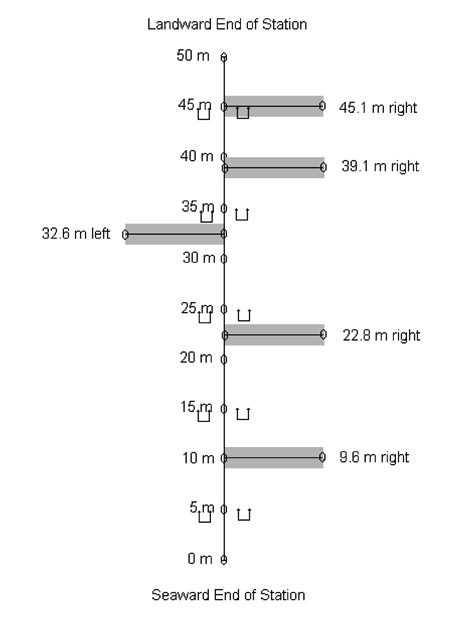

## 1. Introduction

This project will use data from a long-term monitoring project at San Nicolas Island (SNI) to investigate dynamic interactions and predictability between kelp forest brown algae species (*Macrocystis pyrifera* and understory kelps), and various species of invertebrates.  We will see how well these species can predict each other's dynamics, and resolve competitive, mutualistic, and herbivorous species interactions across the timeframe of the dataset.  The species we will look at are:

* **Brown algaes**
    + __*Macrocystis pyrifera*__, giant kelp (adult, >1m tall)
    + __*Macrocystis pyrifera*__, giant kelp (juveniles, <1m tall)
    + __*Laminaria*__ species (combined)
    + __*Cystoseira osmundacea*__
    + __*Pterygophora californica*__
    + __*Eisenia arborea*__, southern sea palm

* **Echinoderms**
    + __*Strongylocentrotus purpuratus*__, purple sea urchin
    + __*S. franciscanus*__, red sea urchin
    + __*Patiria miniata*__, bat star
    + __*Pisaster giganteus*__, giant sea star
    + __*Parastichopus parvimensis*__, warty sea cucumber

* **Gastropods**
    + __*Megastraea undosa*__, wavy turban snail

***

#### The San Nicolas Island Dataset

San Nicolas Island is a small, remote island situated about 100 kilometers offshore from southern California. The benthic monitoring data herein have been collected more or less every six months for more than 30 years by the USGS and its Western Ecological Research Center (USGS-WERC), and in 2013 the datasets were made available publicly through Ecological Archives:

Michael C. Kenner, James A. Estes, M. Tim Tinker, James L. Bodkin, Robert K. Cowen, Christopher Harrold, Brian B. Hatfield, Mark Novak, Andrew Rassweiler, and Daniel C. Reed. 2013. A multi-decade time series of kelp forest community structure at San Nicolas Island, California (USA). Ecology 94:2654. http://dx.doi.org/10.1890/13-0561.1

The datasets together represent a remarkable record of rocky reef dynamics, across varying environmental conditions such as major storm events and shifts in large oceanographic cycles like the El Nino Southern Oscillation and the Pacific Decadal Oscillation. From the abstract:

> San Nicolas Island is surrounded by broad areas of shallow subtidal habitat, characterized by dynamic kelp forest communities that undergo dramatic and abrupt shifts in community composition. Although these reefs are fished, the physical isolation of the island means that they receive less impact from human activities than most reefs in Southern California, making San Nicolas an ideal place to evaluate alternative theories about the dynamics of these communities. Here we present monitoring data from seven sampling stations surrounding the island, including data on fish, invertebrate, and algal abundance. These data are unusual among subtidal monitoring data sets in that they combine relatively frequent sampling (twice per year) with an exceptionally long time series (since 1980). Other outstanding qualities of the data set are the high taxonomic resolution captured and the monitoring of permanent quadrats and swaths where the history of the community structure at specific locations has been recorded through time. Finally, the data span a period that includes two of the strongest ENSO events on record, a major shift in the Pacific decadal oscillation, and the reintroduction of sea otters to the island in 1987 after at least 150 years of absence. These events provide opportunities to evaluate the effects of bottom-up forcing, top-down control, and physical disturbance on shallow rocky reef communities.

The island itself is small, about 14 kilometer long and 5 km wide. The seven sampling stations are situated around the island, some in pairs:


```{r, echo=F}
library(knitr)
opts_chunk$set(tidy.opts=list(width.cutoff=60),tidy=TRUE)
```

```{r monitoring stations,message=F,echo=F}
W_D <- getwd()
monitoring_stations <- read.csv(paste0(W_D,"/data/Table1_Monitoring_Stations.csv"))
names(monitoring_stations) <- c("Station Number","Station Name","Latitude","Longitude","Mean Depth (m)","Date First Sampled")

kable(monitoring_stations,align=c("c","l","c","c","c","l"),caption="SNI Monitoring Stations.")
```

Data is collected at each station during each monitoring period on the density and percent cover of benthic species (algae and invertebrates), and benthic and midwater fish species. Each of the seven monitoring sites has a number of permanent swaths along which data is collected every period:



For full description of the monitoring methods, see the metadata from Kenner et al. (2013) at the DOI above. For our analyses, we use a subset of data, compiled from the benthic density raw data. Data for the 12 species of interest (above) were compiled, and to maximize the potential amount of dynamic information, the data from each swath at each station was treated as a separate time series, leaving us with 37 time series for each of the 12 species. Each time series contains 63 data points, corresponding to the 63 monitoring periods, one approximately every six months from Fall, 1980 to Fall, 2011. Individual time series of species density were normalized to have a mean of zero and a standard deviation of 1.

These first lines of code import the benthic data we need.
  
```{r setup, message=F}
# Here are some R libraries we need
library(quantreg)
library(ggplot2)
library(tidyr)
library(dplyr)
library(rEDM)
library(reshape2)
library(knitr)

#### Data ####
# The raw data has been processed into a set of normalized time series elsewhere.
W_D <- getwd()
dat.long <- read.csv(paste0(W_D,"/data/benth_data_trim_normalized2016-09-09.csv"))

# our particular species of interest
study_spp <- c("pat","red","purp","wavy","paras","pis","cys","lam","eis","pter","mac","ymac")
```

We also import a species name key, mostly for reference and plot labeling later.

```{r species key}
# Species Key for all benthic density species (for reference)
#*************************************
spp.key <- read.csv(file=paste(W_D,'/data/Table4_Species_sampled.csv',sep=''),stringsAsFactors = F) # All species, all surveys
spp.key.bdens <- spp.key %>% 
  filter(DataSet=="Benthic density") %>%
  select(-SpeciesCode) %>%
  rename(dataset=DataSet, long=SpeciesName)

# better names
spp.key.bdens$short <- c("pat","red","purp","wavy","astro","derm","halc","halr","limp","paras","pis","pyc","cys","lam","ymac","youn","eis","pter","mac")
# ************************************

# quick function to turn a "genus species" identifier into an abbreviated gen.spe identifier
abbr.species.names <- function(x) {
    temp <- strsplit(x," ")[[1]]
    g <- substr(temp[1],1,3)
    spe <- substr(temp[2],1,3)
    paste(g,spe,sep=".")
}

# Names to apply to plots later
spp.key.bdens$plotting <- sapply(spp.key.bdens$long,abbr.species.names)

# identify kelp juveniles as a separate variable
spp.key.bdens$plotting[spp.key.bdens$long=="Macrocystis pyrifera <1m"] <- "Mac.pyr(j)"
```

Next we produce a block (wide-form) dataset, where each column represents a species' time series.

```{r block data}
# Cast to wide form
#*************************************
benthdat.block <- dat.long %>%
  select(-dens) %>%
  spread(key=spp,value=norm) %>%
  arrange(site)
#*************************************
```

To keep things simple, for now we are only concerned with the West End sites. This is where a sea otter reintroduction was done, and so we are interested in the dynamics there.

```{r cut to west end}
benthdat.block <- benthdat.block %>%
  filter(site %in% c("2_10L", "2_22L", "2_32R", "2_39L", "2_45L", "3_10R", "3_22R", "3_32L", "3_39R", "3_45L"))
```

### Adding Physical Variables

Along with investigating dynamic species interactions, we also want to explore where physical forcing fits into our dynamic story. A body of other research has established that a combination of physical forcing (waves, storms), temperature, and lower frequency climate modes (e.g., El Ninos) have an important influence on the dynamics of kelp forests (Reed et al., 2011; Cavanaugh et al., 2011; Bell et al., 2015; Young et al., 2015). With these data, we can draw connections between the physical variables and not just *Macrocystis pyrifera* dynamics, but all of the species in our constrained trophic web.

We have four datasets, already processed into the same time frame (periods) as the SNI benthic monitoring data (with separate code not included here):

* **The Multivariate ENSO index (MEI)**
    + The first principal component of a composite set of physical parameters
    + Positive values of the MEI index are generally associated with El Nino conditions, decreases in wind-driven upwelling, warmer surface waters and nutrient-poor conditions
    + From NOAA, http://www.esrl.noaa.gov/psd/enso/mei
    + Variable here is the average index value for the four months preceding each Spring or Fall monitoring period (i.e., December to March or June to September, respectively)
* **The Pacific Decadal Oscillation index (PDO)**
    + Leading empirical orthogonal function (EOF) of monthly sea surface temperature anomalies (SST-A) over the North Pacific (poleward of 20° N) after the global average sea surface temperature has been removed
    + Positive PDO values indicate warmer SST, and nutrient-poor conditions along the western coast of the contiguous United States
    + Obtained from http://research.jisao.washington.edu/pdo/
    + Aggregated and averaged the same way as MEI
* **The North Pacific Gyre Oscillation (NPGO)**
    + From Di Lorenzo, 2008, http://www.o3d.org/npgo/
    + Climate pattern that emerges as the 2nd dominant mode of sea surface height variability (2nd EOF SSH) in the Northeast Pacific
    + Better correlated with salinity, nutrients, and chlorophyll than PDO, showing forcing for the planktonic community
    + Strong predictor of upwelling cells south of 38 deg N
    + Aggregated and averaged the same way as MEI and PDO
* **Sea surface temperature (SST)**
    + Sea surface temperature data from Begg Rock and San Nicolas Island buoys, from the [Coastal Data Information Program (CDIP)](cdip.ucsd.edu)
    + Incomplete data (only have data since 1996)
    + Similar to the above, value is an average SST for the four months preceding each period
* **Maximum significant wave height (Hs)**
    + Also from the Begg and SNI buoys and the CDIP
    + Signficant wave height is defined as the average height, in meters, of the one third highest waves in the record
    + Instead of an average, value here is the maximum significant wave height of the four months preceding each period. This is meant to capture any large storm events, as well as general level of physical disturbance
  
As with the other variables in our analysis, these physical variables have been normalized to zero mean and unit standard deviation to facilitate comparison among variables and not distort state-space reconstructions. Unlike the biological data, where there are unique spatial replicates, the physical data have only one value for each of the 63 monitoring periods, and hence their values are replicated (copied) for each site to match the total length of the biological data.

```{r physical variable import}
# Read in the physical variables
phys.dat <- read.csv(paste0(W_D,"/data/phys_vars_combined.csv"))
phys.dat.norm <- read.csv(paste0(W_D,"/data/phys_vars_combined_norm.csv"))

# Combine with benthic biological block data, by period
multiblock <- benthdat.block %>% left_join(phys.dat.norm,by="period")

phys.vars <- c("mei.mean","pdo.mean","npgo.mean","waves.max","sst.mean")

# Add them to the an overall name key
phys.vars.key <- data_frame(long=c("Multivariate ENSO Index","Pacific Decadal Oscillation","North Pacific Gyre Oscillation","Significant Wave Height","Sea Surface Temperature"),dataset="Physical",short=phys.vars, plotting=c("(P) MEI","(P) PDO","(P) NPGO","(P) Max Hs","(P) SST"))

fullkey <- bind_rows(spp.key.bdens,phys.vars.key)
fullkey <- bind_rows(fullkey, data_frame(long="NA",dataset="NA",short="const",plotting="Constant"))
```

***

## 2. Establishing Cross-variable Causality (cross-mapping)

#### Analytical Approach: Empirical Dynamic Modeling

The datasets' long record and large number of species allows for a detailed look at many aspects of kelp forest dynamics. The study of kelp forest community dynamics in California has a long history, with a wide breadth of empirical, experimental, and modeling literature documenting the structure and function of kelp forest communities, the bottom-up and top-down forces controlling relative species abundance, and characteristic kelp forest species interactions (e.g., Harrold and Reed, 1985; Foster and Schiel, 1985; Paine, 1992; Sala and Graham, 2002; Reed et al., 2011). Some more recent work has revealed nonlinear effects of certain drivers on kelp dynamics (Bell et al., 2015), and hinted at the importance of considering indirect interactions (Arkema et al., 2009). 

The preponderance of evidence from the southern California kelp forest literature paints a view of these ecosystems as dynamic and complex, with the influences of physical oceanography and various biological forces interacting in a nonlinear manner to structure kelp forest communities. In the analysis below, we employ a set of methods, jointly called Empirical Dynamic Modeling (EDM), that has been specifically designed to describe nonlinear dynamic systems of multiple variables. To my knowledge, EDM has never before been applied to describe kelp forest data.

Briefly, EDM is based on the idea that a dynamic system can be reconstructed from time series of observations of that system. [This video animation](https://youtu.be/fevurdpiRYg) (https://youtu.be/fevurdpiRYg) gives a good introduction to this type of reconstruction. Basically, we can interpret a dynamic system as existing in multivariate coordinate space, or state-space, where each member of the dynamic system is one dimension.  If it has predictable dynamics, as the dynamic system evolves in time, a  multidimensional "manifold" or "attractor" emerges, and its states are recorded in each variable's time series as projections onto one-dimensional axes (see the video animation). In a mathematical theorem attributed to Takens (1981), it was shown that one can reconstruct a "shadow" version of the original manifold using lagged versions of just one of the state variables, like a one-dimensional shadow cast by the system as it moves along the manifold. The reconstruction should maintain the mathematical properties of the original attractor.  For example, in the image below, we see an attractor on the left formed from the coupled interactions of three variables (we could call them species) evolving through time. On the right, we see a shadow reconstruction of that attractor using two lags of just the y-variable. The two versions of the attractor maintain similar topological properties, and we can infer properties of the manifold on the left by examining the manifold on the right. 


Reconstructing these manifolds and using them to explore the properties of dynamic systems is a form of state-space reconstruction. The motivation behind state-space reconstruction is that by building a facsimile of the true attractor, we can use it to predict the dynamics of individual variables and investigate how they are related. Takens' original theorem and extensions of it (especially see Sugihara and May, 1990; Sugihara, 1994; Deyle et al., 2011; Sugihara et al., 2012) provide specific methods for examining state-space reconstructions, and their numerous and flexible applications. Together, the methods arising from this work have become known as Empirical Dynamic Modeling (EDM), and it is these tools that we use in the following analyses. The methods are "empirical" in the sense that we use recorded time series data to reveal the underlying dynamic system, with no *a priori* assumptions about the relationships between variables, except that they are members of the system (which we also test for). Because of this approach, EDM can be an ideal option for exploring nonlinear and complex dynamic systems, where other restrictive assumptions are not appropriate.

In the analysis that follows, in each step that involves a new type of EDM method, its logic will be briefly described.  However, keep in mind that the basic theory behind each individual method is the same: We use some dynamic information (from single or multiple time series) to reconstruct a shadow attractor, and then use the properties of that manifold to make predictions.

***

#### Note about data processing

Usual best practice for EDM is to create normalized time series, so that state-space reconstructions are not distorted by differences in orders of magnitude between variables. In addition, in this study we concatenate each species/station/swath time series into one long time series for each species, while preserving a time indicator (variable 'period') and a site identifier, to ensure that we do not "cross" the boundaries of replicate time series in analyses. Empirical dynamic modeling can use multiple spatial replicates in lieu of increased length of individual time series, to maximize the dynamic information that can be drawn from the system (see Hsieh et al., 2008; Clark et al., 2015). Because the monitoring methods and species are the same across the island, and SNI itself is small, we choose to concatenate the available time series into one long time series for each species. However, we do examine the validity of this assumption in Step 3, and the reader should bear in mind that these data are from multiple transects across multiple stations around SNI.

***

### Establishing Univariate Predictability and Nonlinearity

For each of these time series, we have a few steps to see if they seem appropriate to analyze together with EDM techniques. We want to be careful that our state space reconstructions are reliable and represent valid manifolds. In other words, we don't want to rely on simple cross-correlation or the prior knowledge that all these data were collected at the same island at the same times. We want evidence that:

1. Variables can be probably embedded (i.e., they show evidence of limited system dimensionality)
2. Variables display state-dependent (nonlinear) dynamics, and therefore that nonlinear (EDM) methods are appropriate for analysis of these data
3. Specific monitoring sites display dynamics that are predictable from other sites' dynamics, validating the approach of concatenating time series data.

First, we use simplex projection to get a sense of system dimensionality for each variable, which will also give us an idea of the appropriate embedding dimension to use in later analyses. Then, we explicitly look for evidence of state-dependence and nonlinear dynamics with a prediction horizon test and S-maps.  Finally, we will determine individual species' cross-predictability across monitoring stations.

***

#### Simplex Projection and Embedding Dimensions

For each species/variable separately, we will search for signals of deterministic behavior using simplex projection. In simplex projection, we first reconstruct a shadow attractor in *E* dimensions, where *E* is the number of variables, or number of progressive lags of a single variable used in the reconstruction. *E* is called the __*embedding dimension*__. The *E*-length vectors, for example $\it{\bf{x_{t}}} = <x_t,x_{t-1},x_{t-2}>$ are points on the attractor, and the set of *E*-length vectors used for the reconstruction is called the __*library*__. To predict $\it{\bf{x_{t+1}}}$, the simplex algorithm finds the *E* +1 nearest neighbors of $\it{\bf{x_{t}}}$ in the state space, and the prediction $\it{\bf{\hat{x}_{t+1}}}$ is the average of the nearest neighbors' values at $\it{t+1}$, weighted by their Euclidean distance from $\it{\bf{x_{t}}}$ at $\it{t}$. This is the essence of simplex projection: a forecast for a given point in state space is surmised from the forward trajectories of observed nearby points.

In descriptive terms, this is akin to asking, "When the system has been in a state like this before, what happened next?" For example, if we are interested in predicting *Macrocystis* density next year, we might take the current three-year density trend (this year, last year, and the year before, *E*=3) and compare it to a subset of times in the past when three-year dynamics looked similar to today. Our prediction, logically, would be the average of that subset, projected foreward one year and weighted by their similarity to the current trend.

By varying the value of *E*, we can determine what the best embedding dimension is for each variable in our analysis, essentially a proxy for the number of variables that best "unfolds" or best represents the shadow attractor. We can measure the "skill" of an embedding by comparing the estimated forecasts $\it{\bf{\hat{x}_{t+1}}}$ with the observed values $\it{\bf{x_{t+1}}}$, and we report it with $\it{\bf{\rho}}$, the Pearson correlation coefficient between predictions and observations. To avoid in-sample fitting, we use a leave-one-out cross-validation scheme, removing one vector at a time from the library, and predicting its dynamics from the other library vectors.

```{r univariate simplex,fig.height=10,fig.width=7}
# For all the steps in the univariate analyses, we need an indication of the breaks in the different sites, or concurrent time series (see Note about data processing, above).

# This piece of code holds the row numbers of the first and last element of each time series, in order to avoid "crossing" time series in later analyses
segs_sites <- multiblock %>%  
  mutate(ind = row_number()) %>% 
  group_by(site) %>%
  summarise(first=first(ind),last=last(ind))

# Time series segments without site identifier. We'll need this later
segs <- select(segs_sites,-site)

# List to store output of simplex projection
simp.list <- list()

# Run simplex projection for each species, and plot output
par(mfrow=c(3,2))
for(i in 1:length(study_spp)) {
  spp <- study_spp[i]
  dat <- multiblock %>% select(matches(spp)) %>% as.data.frame()
  out <- simplex(as.numeric(dat[,1]),lib=as.matrix(segs),E=2:15,silent=T)
  simp.list[[spp]] <- out
  
  # Plot embedding dimension vs. predictive ability (rho)
  plot(out$E,out$rho,type="l",main=fullkey$long[match(spp,fullkey$short)],xlab="Embedding Dimension (E)",ylab=expression(paste("Skill, ",rho)))
}
```

```{r, echo=F}
rm(spp,dat,out)
```

We also need to run simplex projection for the physical variables, in order to establish their optimal embeddings. As a reminder, the physical variables are the same across all biological spatial replicates. Therefore, there are fewer library vectors for the physical variables, especially since there is some missing data for some variables.

```{r simplex physical variables,fig.height=10,fig.width=7}
# Run simplex for each physical variable
par(mfrow=c(3,2))
for(i in 1:length(phys.vars)) {
  ind <- phys.vars[i]
  dat <- multiblock %>% select(matches(ind))
  out <- simplex(as.numeric(dat[,1]),lib=c(1,63),E=2:10,silent=T)
  simp.list[[ind]] <- out
  
  # Plot embedding dimension vs. predictive ability (rho)
  plot(out$E,out$rho,type="l",main=fullkey$long[match(ind,fullkey$short)],xlab="Embedding Dimension (E)",ylab=expression(paste("Skill, ",rho)))
}
```

```{r, echo=F}
rm(ind,dat,out)
```

All of the variables show a decent ability to self-predict, as shown by simplex projection. Many variables are well-embedded in a low number of dimensions (6 or fewer). Some variables,however, require high embedding dimensions, which suggests quite complex dynamics. One variable, *Pisaster giganteus*, does not show a peak in predictability within our range of embedding dimensions, and displays relatively low predictability overall. Similarly, *Parastichopus parvimensis* shows very minimal predictability. Because of this, we remove *Pisaster* and *Parastichopus* from any further analyses.

```{r remove p giganteus}
multiblock <- multiblock %>% select(-pis,-paras)
study_spp <- setdiff(study_spp,c("pis","paras"))
```

For each variable, we save its optimal embedding dimension. For a couple of individual variables, we manually choose a smaller embedding dimension than the absolute maximum found in the previous step, to avoid unnecessary model complexity, and reduce overfitting, while maintaining predictive power.

```{r best E}
bestE <- sapply(simp.list,function(x) {
  temp <- x %>% filter(!is.na(rho))
  temp$E[temp$rho==max(temp$rho)]
})
```


***

#### Prediction Decay

We also want to look at prediction decay for each variable, which is one piece of evidence that a dynamic system is nonlinear. Using the best *E* identified in the previous step, we attempt to make predictions increasing far into the future, instead of just one period ahead. A nonlinear system should show decreasing predictive power with increasing prediction horizon. This phenomenon is analagous to the "butterfly effect", where in a nonlinear system, trajectories in state-space are expected to diverge over time. To examine this effect, we hold *E* constant, and proceed with simplex projection as before, but varying the prediction horizon, $t_p$.

```{r prediction horizon,fig.height=10,fig.width=7}
# List to hold prediction horizon results
tp.list <- list()

par(mfrow=c(2,2))
for(i in 1:length(study_spp)) {
  spp <- study_spp[i]
  dat <- multiblock %>% select(matches(spp))
  out <- simplex(as.numeric(dat[,1]),lib=as.matrix(segs),silent=T,E=bestE[spp],tp=1:10)
  tp.list[[spp]] <- out
  
  # Plot time horizon vs. predictive ability (rho)
  plot(out$tp,out$rho,type="l",main=fullkey$long[match(spp,fullkey$short)],xlab="Time to Prediction",ylab=expression(paste("Skill, ",rho)))
}
```

```{r, echo=F}
rm(spp,dat,out)
```

The prediction horizon effect check is promising overall, as most variables decline in predictive ability with increasing time horizon. For *Cystoseira osmundacea*, there is some evidence of cyclic behavior, in that dynamics are more predictable 10 periods in the future than 3 or 4 periods. We remove *Cystoseira* from further analysis

```{r remove p giganteus}
multiblock <- multiblock %>% select(-cys)
study_spp <- setdiff(study_spp,"cys")
```

***

#### Determining Nonlinearity with S-maps

We can look for further evidence of nonlinearity with S-maps. S-maps is short for "sequentially weighted global linear maps", and it is similar to simplex projection, except instead of using just the *E* +1 nearest neighbors to make forecasts, S-maps uses all library vectors, and exponentially weights them by their distance to the prediction vector before using linear regression to make a forecast. A parameter, $\it{\bf{\theta}}$, tunes how much greater weight is given to nearby points. If $\it{\bf{\theta}}=0$, all library vectors are weighted equally, and the resulting model is just a vector autogressive (VAR) model of order *E*. However, as $\it{\bf{\theta}}$ is tuned above 0, nearby points in state-space are given more weight in forecasts. Therefore, if model skill $\it{\bf{\rho}}$ increases with increasing $\it{\bf{\theta}}$, it is evidence of nonlinear, state-dependent dynamics. For a more formal description of the S-maps procedure, see Sugihara, 1994 and Deyle et al., 2016.

As a side note, with $\it{\bf{\theta}}>0$, although the set library vectors remains constant, the *weights* given to library vectors for regression is specific to each point in state-space, and therefore a separate linear map is created for each predicted vector. This is why the procedure is called "sequentially weighted global linear maps". Conceptually, as the dynamic system moves along the surface of the attractor, S-maps sequentially computes linear maps to the next point based on nearby points. This sequential weighting becomes important for our analysis in Step 5.

For prediction of each variable using S-maps, we can again use the optimal embedding dimension, *E*, found through simplex projection, and we plot the tuning parameter $\it{\bf{\theta}}$ against $\it{\bf{\rho}}$ to look for evidence of nonlinear dynamics.

```{r univariate s_maps,fig.height=10,fig.width=7}
smap.list <- list() # list to store output

par(mfrow=c(3,2))
for(i in 1:length(study_spp)) {
  spp <- study_spp[i]
  dat <- multiblock %>% select(matches(spp))
  out <- s_map(as.numeric(dat[,1]),lib=as.matrix(segs),E=bestE[spp],silent=T)
  smap.list[[spp]] <- out
  
  # Plot theta dimension vs. predictive ability (rho)
  plot(out$theta,out$rho,type="l",main=fullkey$long[match(spp,fullkey$short)],xlab=expression(paste("Nonlinearity (",theta,")")), ylab=expression(paste("Skill, ",rho)))
}
```

```{r, echo=F}
rm(spp,dat,out)
```

All variables show significantly improved predictive ability with increased theta, suggesting nonlinear dynamics. Together, the simplex, prediction horizon, and S-map results suggest our approach is valid--variables are predictable, and most predictable in a nonlinear manner.

***

### Convergent Cross-Mapping

#### Introduction to Convergent Cross Mapping

Generalizations of Takens' theorem indicate that if two variables (in our case, species or physical variables) are part of the same dynamic system, their individual dynamics should reflect their relative causal influence (see Sugihara et al., 2012; Deyle et al., 2013; Ye et al., 2015; Clark et al., 2015) . In other words, if one variable (for example, giant kelp), is casually forced by another (sea urchins), that forcing should leave a signature on the giant kelp time series. Convergent cross mapping (CCM) tests for causation by using the attractor/manifold built from the time series of one variable to predict another. CCM works just like univariate simplex projection that we did in Step 3, except that separate variables are used for library and prediction vectors. In addition, we normally predict contemporaneous values of the other variable, instead of projecting one step forward (prediction horizon $t_{p}=0$). If the attractor can accurately (based on out-of-sample prediction skill, just as before) predict the dynamics of the second variable, we can claim that the second variable has a causal influence on the first.  In other words, the *causal effect of A on B is determined by how well B cross-maps A*. In this way, the inference from cross-mapping is the converse direction of causation. In our example, if sea urchins drive giant kelp,the dynamic information from the urchin time series should be reflected in the kelp dynamics, and kelp should significantly cross-map the urchins.

Cross-mapping can distinguish unidirectional forcing (A forces B but B does not force A) from bi-directional (A and B force each other). It can also resolve transitive causal chains (A causes B causes C, see Fig. 4 in Sugihara et al., 2012 for an illustration). To look for a causal signal, we plot predictive skill  $\it{\bf{\rho}}$ against library size (the number of embedded vectors used to construct the attractor). There are two criteria for CCM to establish causality. First, and most obviously, predictive cross-map skill using all available data should be significantly greater than zero. Second, that predictability should be convergent.  Convergence means that cross-mapped estimates improve with library length, because the attractor is more fully resolved and therefore estimation error should decline. Convergence is key to distinguishing causation from simple correlation.

The CCM algorithm uses a random sampling method to test multiple "versions" of each library size, sampling a subset from the supplied library vectors to give a sense of the confidence intervals around prediction skill. We again use leave-one-out cross-validation to prevent in-sample fitting.

We can use CCM theory to build a causal network in our kelp forest algae/invertebrate system. We ask, 

"__Which San Nicolas Island kelp forest species are causally linked?__"

***

#### Initial CCM, *Macrocystis pyrifera*

Let us start simple, and see if the two urchin species, red urchin *Strongylocentrotus franciscanus* and purple urchin *S. purpuratus* seem to have a causal influence on *Macrocystis pyrifera*, the giant kelp, and vice versa. The hypothesis is that both pairs of species will display bi-directional causal influence, because of herbivory by urchins on the kelp, and the food provision by the kelp for the urchins.

To be even more conservative in this step, we use only a random half of each time series for both library and prediction sets:

```{r random time series segments}
set.seed(42)
# Sample one half of time series segments, without replacement
rnd_lib_segs <- sample_frac(segs,0.5,replace=F) %>% arrange(first)
# Use other half for prediction
rnd_pred_segs <- anti_join(segs,rnd_lib_segs,by=c("first","last")) %>% arrange(first)

rnd_lib_segs <- as.matrix(rnd_lib_segs)
rnd_pred_segs <- as.matrix(rnd_pred_segs)
```

Now we can perform CCM, mapping in both directions (i.e., using giant kelp time series to cross-map the urchins, and using the urchin time series to cross-map the kelp). For each cross-map, we use the best embedding dimension identified in Step 3 for the target variable (the putative causal process).

```{r CCM macro, message=F}
# zero cutoff function: if rho is less than zero, it doesn't make sense, so we'll set those values to zero for cleaner results
cut_to_zero <- function(x) sapply(x, function(y) ifelse(y<0,0,y))

## Macrocystis and red urchin
#***************************************************
mac_xmap_red <- ccm(multiblock,lib=rnd_lib_segs,pred=rnd_pred_segs,E=bestE["red"],lib_column = "mac",target_column = "red",lib_sizes = c(seq(5,55,by=2),seq(55,500,by=30)),silent=T)

red_xmap_mac <- ccm(multiblock, lib=rnd_lib_segs, pred=rnd_pred_segs, E=bestE["mac"],lib_column = "red", target_column = "mac", lib_sizes = c(seq(5,55,by=2),seq(55,500,by=30)),silent=T)

# To plot, we need to find means and sd's of rho for each library size
mac_xmap_red_means <- mac_xmap_red %>% 
  group_by(lib_size) %>% 
  summarise(mean.rho=mean(rho), sd.rho=sd(rho)) %>%
  mutate(upper=mean.rho+sd.rho, lower=mean.rho-sd.rho) %>%
  mutate_each(funs(cut_to_zero),-lib_size)

red_xmap_mac_means <- red_xmap_mac %>% 
  group_by(lib_size) %>% 
  summarise(mean.rho=mean(rho), sd.rho=sd(rho)) %>%
  mutate(upper=mean.rho+sd.rho, lower=mean.rho-sd.rho) %>%
  mutate_each(funs(cut_to_zero),-lib_size)
#****************************************************

## Macrocystis and purple urchins
#****************************************************
mac_xmap_purp <- ccm(multiblock, lib=rnd_lib_segs,pred=rnd_pred_segs,E=bestE["purp"],lib_column = "mac", target_column = "purp",lib_sizes = c(seq(5,55,by=2),seq(55,500,by=30)),silent=T)

purp_xmap_mac <- ccm(multiblock,lib=rnd_lib_segs,pred=rnd_pred_segs,E=bestE["mac"],lib_column = "purp",target_column = "mac",lib_sizes = c(seq(5,55,by=2),seq(55,500,by=30)),silent=T)

# To plot, we need to find means and sd's for each library size
mac_xmap_purp_means <- mac_xmap_purp %>% 
  group_by(lib_size) %>% 
  summarise(mean.rho=mean(rho), sd.rho=sd(rho)) %>%
  mutate(upper=mean.rho+sd.rho, lower=mean.rho-sd.rho) %>%
  mutate_each(funs(cut_to_zero),-lib_size)

purp_xmap_mac_means <- purp_xmap_mac %>% group_by(lib_size) %>% 
  summarise(mean.rho=mean(rho), sd.rho=sd(rho))%>%
  mutate(upper=mean.rho+sd.rho, lower=mean.rho-sd.rho) %>%
  mutate_each(funs(cut_to_zero),-lib_size)
```

As mentioned above, we look for causation by plotting library size versus predictive skill for *Macrocystis* and red and purple urchins.

```{r mac x red and purp plots, echo=F,fig.height=4}
mac_x_red_plot <- ggplot()+
  geom_line(data=mac_xmap_red_means,aes(x=lib_size,y=mean.rho,color="Macrocystis xmap S. Fransciscanus"))+
  geom_ribbon(data=mac_xmap_red_means,aes(x=lib_size,ymin=lower,ymax=upper,fill="Macrocystis xmap S. Fransciscanus"),alpha=0.3)+
  geom_line(data=red_xmap_mac_means,aes(x=lib_size,y=mean.rho,color="S. Fransciscanus xmap Macrocystis"))+
  geom_ribbon(data=red_xmap_mac_means,aes(x=lib_size,ymin=lower,ymax=upper,fill="S. Fransciscanus xmap Macrocystis"),alpha=0.3)+
  scale_colour_manual(name=NULL, labels=c("Macrocystis xmap S. Fransciscanus","S. Fransciscanus xmap Macrocystis"),values=c("darkred","darkgreen"))+
  scale_fill_manual(name=NULL, labels=c("Macrocystis xmap S. Fransciscanus","S. Fransciscanus xmap Macrocystis"),values=c("darkred","darkgreen"))+
  theme(legend.key = element_blank(),legend.justification=c(0,1), legend.position=c(0,1),
        panel.background=element_rect(fill="white",color="black"))+
  geom_hline(yintercept=0,linetype=2,color="gray40")+
  ylim(-0.05,1) +
  ggtitle("Macrocystis and S. Fransciscanus Cross Mapping")+
  xlab("Library size")+
  ylab(expression(paste("Cross-map skill, ",rho)))

mac_x_purp_plot <- ggplot()+
  geom_line(data=mac_xmap_purp_means,aes(x=lib_size,y=mean.rho,color="Macrocystis xmap S. Purpuratus"))+
  geom_ribbon(data=mac_xmap_purp_means,aes(x=lib_size,ymin=lower,ymax=upper,fill="Macrocystis xmap S. Purpuratus"),alpha=0.3)+
  geom_line(data=purp_xmap_mac_means,aes(x=lib_size,y=mean.rho,color="S. Purpuratus xmap Macrocystis"))+
  geom_ribbon(data=purp_xmap_mac_means,aes(x=lib_size,ymin=lower,ymax=upper,fill="S. Purpuratus xmap Macrocystis"),alpha=0.3)+
  scale_colour_manual(name=NULL, labels=c("Macrocystis xmap S. Purpuratus","S. Purpuratus xmap Macrocystis"),values=c("purple","darkgreen"))+
  scale_fill_manual(name=NULL, labels=c("Macrocystis xmap S. Purpuratus","S. Purpuratus xmap Macrocystis"),values=c("purple","darkgreen"))+
  theme(legend.key = element_blank(),legend.justification=c(0,1), legend.position=c(0,1),
        panel.background=element_rect(fill="white",color="black"))+
  geom_hline(yintercept=0,linetype=2,color="gray40")+
  ylim(-0.05,1) +
  ggtitle("Macrocystis and S. Purpuratus Cross Mapping")+
  xlab("Library size")+
  ylab(expression(paste("Cross-map skill, ",rho)))

mac_x_red_plot
mac_x_purp_plot + theme(aspect.ratio=0.6)
```

This initial look suggests that both urchin species affect, and are affected by, the giant kelp *Macrocystis pyrifera*, confirming our expectation. There is significant convergent cross-mapping in both directions. There is some indication in both plots that the bottom-up forcing (kelp forcing urchins) may be stronger than the top-down forcing, as evidenced by greater cross-map skill. 

This is a good start, but of course there may be other important variables to consider.

***

#### Cross-mapping All Species and Physical Variables

Applying CCM in this way to all combinations of species in our data, we can build a "causal web", looking at the strength of cross-map skill between all species.  Importantly, just as in the cross-site predictions in Step 3 and the two examples above, CCM is non-symmetrical, and hence the cross-map of A on B is not the same as the cross-map of B on A.

We include the physical variables as predictors in pairwise CCM, but not as predicted variables. For each cross-map, we impose the two criteria for CCM signficance described above (model skill greater than zero and convergence). We use leave-one-out cross-validation (predicting one lagged vector at a time) to determine model skill.

```{r ccm all species and physical vars}
# Rows hold predicted variables, columns hold forcing variables. There are more columns than rows since the physical variables are included as potential forcing factors.
n_col <- dim(multiblock)[2]-2
n_row <- dim(multiblock)[2]-7
col_names <- colnames(multiblock)[3:(n_col+2)]
row_names <- colnames(multiblock)[3:(n_row+2)]
xmap_mat <- array(NA,dim=c(n_row,n_col),dimnames=list(row_names,col_names))

## CCM causation criterion 1: cross-map skill greater than zero
# matrix to store a bootstrapped p-value, measuring the probability that a given xmap is greater than zero (calculated as 1 minus the number of positive results for rho divided by the number of iterations)
p1.mat <- array(NA,dim=c(n_row,n_col),dimnames=list(row_names,col_names))

## CCM causation criterion 2: evidence for convergence
# similarly, matrix to store a bootstrapped p-value, this time a t-test value between library size 10 and library size 500, to see if the rho at large library is significantly greater than the rho at small library size (i.e., looking for convergence).
p2.mat <- array(NA,dim=c(n_row,n_col),dimnames=list(row_names,col_names))

# if both p1 and p2 are positive, indicate overall significant causal signal
ptot.mat <- array(NA,dim=c(n_row,n_col),dimnames=list(row_names,col_names))

## Run CCM for each combination of variables
for(i in 1:n_row) {
  for(j in 1:n_col) {
    if(i != j) {
      # remember, we use the best embedding dimension for the target variable (the variable we're cross-mapping to, i.e. the putative forcing variable)
      tempE=bestE[col_names[j]]
      temp <- ccm(multiblock,lib=as.matrix(segs),pred=as.matrix(segs),E=tempE,lib_column= 2+i,target_column = 2+j,lib_sizes = c(10,500),num_samples=100,replace=T,silent=T)
      # mean rho at library size 500
      rhomean <- temp %>% filter(lib_size==500) %>% ccm_means()
      xmap_mat[i,j] <- rhomean$rho
      
      # first p-value (greater than zero? at largest library size)
      p1 <- temp %>% filter(lib_size==500) %>% 
        mutate(pos=ifelse(rho>0,1,0)) %>%
        summarise(p=(1-sum(pos)/n()))
      p1.mat[i,j] <- as.numeric(p1)
      
      # second p-value (rho at lib-size 500 greater than rho at lib-size 10?)
      p2 <- t.test(temp$rho[temp$lib_size==10],temp$rho[temp$lib_size==500])$p.value
      p2.mat[i,j] <- as.numeric(p2)
      
      # overall significance (both p1 and p2 signficant at alpha 0.05)
      ptot.mat[i,j] <- ifelse(p1<0.05 & p2<0.05,1,0)
    }
  }
}
```

```{r, echo=F}
rm(p1,p2,tempE,temp,rhomean)
```

We can make a raster plot of the output (Figure 5).

```{r CCM raster, include=F,message=F}
# keep only signficant cross-mappings
xmap_mat <- xmap_mat*ptot.mat %>% as.data.frame()
xmap_rast <- xmap_mat %>% 
  mutate(predictee=row.names(xmap_mat)) %>% 
  gather(key=predictor,value=rho,eis:sst.mean)

# If rho is zero, replace with NA (no significant causal signal)
xmap_rast$rho[xmap_rast$rho==0] <- NA

# Names for plotting to distinguish biological and physical variables
xmap_rast <- xmap_rast %>% 
  mutate(force.name=fullkey$plotting[match(predictor,fullkey$short)]) %>%
  mutate(pred.name=fullkey$plotting[match(predictee,fullkey$short)])

## plot
xmap_all_plot <- ggplot(xmap_rast,aes(x=force.name,y=pred.name,fill=rho)) +
  geom_raster() +
  scale_fill_gradient(low = "#9AFF9A", high = "#548B54", space = "Lab", na.value = "grey50", 
      guide = "colourbar",name=expression(paste(rho, "(skill)"))) +
  ggtitle("Kelp Forest Convergent Cross Mapping") +
  xlab("Predictor (Forcing Variable)") +
  ylab("Predicted Variable") +
  theme(axis.text.x=element_text(angle = 90, hjust = 1,vjust=0.1))

xmap_all_plot
ggsave("westend_xmap_all.png")

# list of significant variables for each species
ccm.sig.vars<-list()
for(i in 1:length(study_spp)) {
  spp <- study_spp[i]
  vars <- xmap_rast %>% filter(predictee==spp,rho!=0)
  ccm.sig.vars[[spp]] <- vars$predictor
}

rm(spp,vars)
```


From this plot, we can draw a few conclusions. The five physical forcing variables are represented in the first five columns, followed by the three brown algaes, and then the invertebrates. Many physical variables show causal relationships with kelp forest species, especially the North Pacific Gyre Oscillation, which shows a causal link to all species except *Laminaria*, and SST, which shows a link to all species except *Eisenia* and *Patiria*.

The strongest relative forcing variables of giant kelp dynamics ("Mac.pyr" row) are purple urchins *Strongylocentrotus purpuratus*, the understory alga *Eisenia arborea*,the wavy turban snail *Megastraea undosa*, sea surface temperature, and the NPGO. The adult *Macrocystis pyrifera* in turn has a strong causal effect on many species, including *Laminaria* and *Pterygophora californica*, purple urchin, and red urchin *S. franciscanus*.

Looking at the data from this exercise in another way, we can build an interaction web (Figure 6), and also see the number of links (causal or caused by) for each species (its network centrality).


```{r causal web and interactions, echo=F, include=F,message=F}
library(igraph) # R Package for network graphing and analysis

# Add NAs for connections in to physical variables (since we want them just to be exogenous)
connect.mat <- t(ptot.mat) %>% 
  as.data.frame() %>%
  mutate(mei.mean=rep(NA,nrow(.)),pdo.mean=rep(NA,nrow(.)),npgo.mean=rep(NA,nrow(.)),waves.max=rep(NA,nrow(.)),sst.mean=rep(NA,nrow(.))) 

g <- graph.adjacency(as.matrix(connect.mat))
par(mfrow=c(1,1))

# Variable names
names <- sapply(V(g)$name, function(x) fullkey$plotting[match(x,fullkey$short)])
names [10:14] <- c("MEI","PDO","NPGO","Max Hs","SST")

# Vertex labels, specifying number of causal connections
V(g)$name <-names
vert_in <- sapply(degree(g,mode="in"),function(x) paste0("(",x,")"))
vert_out_in <- paste0(degree(g,mode="out"),vert_in)
V(g)$label <- paste(sep="\n",V(g)$name, vert_out_in)

# vector of node colors for plotting
vert.cols <- c(rep("tan3",3),"orchid3","tan3",rep("orchid3",2),"darkseagreen","tan3",rep("gray70",5))

# Vertex layout
# write.csv(tk_coords(5),file=paste0(W_D,"/data/westend_causal_web_coords.csv"))
# vert.lay <- as.matrix(read.csv(paste0(W_D,"/data/westend_causal_web_coords.csv")))

plot(g, vertex.label.color="black", vertex.label.cex=0.8, edge.arrow.size=0.6,vertex.label.font=2, vertex.size=25,edge.lty=2,edge.color="gray80",vertex.frame.color=NA,vertex.color=vert.cols,main="",edge.curved=F)

legend(x=-0.6, y=-1, c("Brown Algae","Echinoderms", "Gastropods","Physical Forcing"), pch=21, pt.bg=c("tan3","orchid3","darkseagreen","gray70"),pt.cex=2, cex=1, bty="n", ncol=1,text.col="black")
```

In this network, each node represents a variable, and the numbers associated with each are the number of causal connections in the web, outgoing and (incoming). The potential maximum incoming connections is 13 (14 total variables minus itself), and the maximum outgoing is 8 (subtracting the physical variables). We can make a number of observations from this web. For example:

* Kelp forests are dynamically complex, with an intricate network of causal interactions between species. There are many bi-directional signals, and therefore not as much clear unidirectional causation. This is not surprising, as we would expect that, e.g., the algaes and herbivores would affect each other.
* Macrocystis itself (a primary producer) and the two urchin species are central to dynamics, having the most total connections, followed by the gastropod *Megastraea undosa* and the understory kelps.

It is clear, even from our constrained food web, that the dynamics of each species rely on a number of other species, and hence a comprehensive understanding of a kelp forest communities necessarily requires consideration of not just linear trophic interactions, but an appreciation of the full web of interacting species. Given that these species are so interconnected, it may be that we could better predict dynamics, and can take a step towards a more mechanistic understanding of the interactions suggested from the CCM analysis, by explicitly considering multivariate models.

We now have evidence that adult *Macrocystis pyrifera* drives *Pterygophora californica* dynamics, but is their interaction competitive? Does the strength of the interaction change when more nutrients are available? Do the red urchin *Strongylocentrotus fransciscanus* and the purple urchin *S. fransciscanus* compete? Or do they perhaps display apparent positive effects on one another through their mediating effects on algal competetive interactions?  Informed by the outcomes of the univariate and cross-mapping analyses, we can explicitly examine the strength and direction of species' interactions through time by building composite attractors from multiple species' time series.

This is our next task.

***

## 3. Building Multivariate Models

Every EDM method we have used so far involves reconstructing an attractor in state-space and then examining that attractor to make predictions. In Step 3, we used single time series and their lags to build attractors, and examined the attractors for evidence of the degree of dimensionality, predictability, and nonlinearity. In Step 4, we built attractors from one species and searched for the signature of other species' dynamics encoded in those attractors, leading to inferences about causation. 

Multivariate models have the same structure, except instead of using single variables to reconstruct the attractors, we use contemporaneous values of multiple variables. Instead of library vectors/points in state-space taking the form of, for example, $<x_t,x_{t-1},x_{t-2}>$, they now are formed in true multivariate space, e.g. $<Kelp_{t},Urchin_{t},Nutrients_{t}>$. Using the normalized time series, we will build library vectors that each include the variable we are trying to predict, as well as other causal variables illuminated by our CCM analysis. Then we use S-maps to forecast the target variable using leave-one-out cross-validation just as in Step 3.

***

#### Single Embedding, Multiple Versions

To explore dynamic interactions across species, it may be best to use just one multivariate attractor, and then optimize the S-maps for each species separately. Therefore, we are controlling for the same set of interactions across species. Another option would be to separately select the most predictive variables from our set for each species, but that might degrade our ability to draw conclusions.

We choose a subset of species which all show causal links to each other. We can do this with a subset of our cross-mapping exercise from Step 3. We include the NPGO index, SST, and maximum wave height as physical variables that map to almost all our variables.

```{r sub smap, include=F,message=F}
xmap_subset <- function(subspp) {
  subrast <- xmap_rast %>% 
    filter(predictee %in% subspp & predictor %in% subspp)%>%
    mutate(force.name=fullkey$plotting[match(predictor,fullkey$short)]) %>%
    mutate(pred.name=fullkey$plotting[match(predictee,fullkey$short)])
  
  ## plot
  xmap_sub_plot <- ggplot(subrast,aes(x=force.name,y=pred.name,fill=rho)) +
    geom_raster() +
    scale_fill_gradient(low = "#9AFF9A", high = "#548B54", space = "Lab", na.value = "grey50", 
      guide = "colourbar",name=expression(paste(rho, "(skill)"))) +
    xlab("Predictor (Forcing Variable)") +
    ylab("Predicted Variable") +
    theme(axis.text.x=element_text(angle = 90, hjust = 1,vjust=0.1))
  
  xmap_sub_plot
}
subset.CCM.plot <- xmap_subset(c("mac","purp","pter","npgo.mean","lam","red","ymac"))
subset.CCM.plot
ggsave(plot=cohesive.CCM.plot,filename="westend_xmap_subset.png")
```


## 4. Testing Hypotheses

This reduced causation web will allow us to look more closely at species interactions. With three physical variables, three species of algae, and two species of invertebrates, it is a good microcosm of intermediate complexity, representative of some of the dynamics in the larger kelp forest community.

Now we build a multivariate model for each species, using the causal variables from Step 3. We build an multivariate attractor of these species, and then optimize the S-map $\theta$ parameter (degree of nonlinearity) for each species individually. Tuning $\theta$ allows the weights of library vectors to vary across the manifold, and therefore for estimates of species interactions to be specific to different ecosystem states.

```{r uniform multivariate embedding,message=F,warning=F}
# We keep the same embedding for each model fit, but optimize the model (i.e., find best theta and calculate S-maps) for each species individually

species <- c("mac","purp","pter","lam","red","ymac")
lib.vars <- c(species,"npgo.mean")

### Differences between barren and forest dynamics
plot(multiblock$red,multiblock$mac,pch=19)
abline(v=-0.5,lty=2)

multiblock <- multiblock %>% 
  mutate(state=ifelse((red>-0.5 | mac< -0.5),"barren","forest"))

# Data frame to hold optimal theta, and associated rho and mean absolute error (MAE) associated with the chosen model
multi.theta <- data_frame(species=species,theta=numeric(length(species)),rho=numeric(length(species)),mae=numeric(length(species)))

# Lists to hold the model for each species, a "long form" of each model for plotting, and a boxplot of interaction coefficients.
multi.mods <- list()
coeffs <- list()
coeffs.long <- list()
int.box <- list()

for (i in 1:6) {
  spp <- species[i]
  
  # Run multivariate S-maps with varying theta
  temp <- block_lnlp(multiblock,lib=as.matrix(segs),pred=as.matrix(segs),columns=lib.vars,target_column=spp,num_neighbors=0,method="s-map",theta = c(0, 1e-04, 3e-04, 0.001,0.003, 0.01, 0.1, 0.5, 1, 2, 4, 6,8),save_smap_coefficients = F, silent=T)
  
  # Plot theta dimension vs. predictive ability (rho)
  plot(temp$theta,temp$rho,type="l",main=fullkey$long[match(spp,fullkey$short)],xlab=expression(paste("Nonlinearity (",theta,")")), ylab=expression(paste("Skill, ",rho)))
  
  # Find optimal theta based on best predictive skill
  opt.stats <- temp %>% filter(rho==max(rho))
  multi.theta$theta[i] <- opt.stats$theta
  multi.theta$rho[i] <- opt.stats$rho
  multi.theta$mae[i] <- opt.stats$mae
  
  # Save S-map coefficients for the optimal model
  best_model <- block_lnlp(multiblock,lib=as.matrix(segs),pred=as.matrix(segs),columns=lib.vars,target_column=spp,num_neighbors=0,method="s-map",theta = opt.stats$theta,save_smap_coefficients = T, silent=T)
  
  # rename s-map coefficients to variable names for later reference
  colnames(best_model[[1]]$smap_coefficients) <- c(lib.vars,"const")
  multi.mods[[spp]] <- best_model[[1]]
  
  # Save interaction coefficients
  coeffs[[spp]] <- best_model[[1]]$smap_coefficients %>% as.data.frame()
  names(coeffs[[spp]]) <- c(lib.vars,"const")
  coeffs[[spp]]$state <- multiblock$state
  coeffs[[spp]]$period <- multiblock$period
  multi.mods[[spp]] <- best_model[[1]]
  
  # long form for plotting
  coeffs.long[[spp]] <- coeffs[[spp]] %>%
    gather(key=effect,value=value,-state,-period,na.rm=T) %>%
    left_join(fullkey, by=c("effect"="short")) %>%
    mutate(pred.name=fullkey$plotting[match(effect,fullkey$short)]) %>%
    group_by(effect)
  
  # box plot of interactions
  sppname <- fullkey$long[match(spp,fullkey$short)]
  int.box[[spp]]<- ggplot(coeffs.long[[spp]],aes(x=pred.name,y=value,fill=state))+
    geom_boxplot() +
    geom_hline(yintercept=0,linetype=2,col="gray40")+
    xlab("Interacting Variable") +
    ylab("Coefficient") +
    ggtitle(paste("Interactive Effects on Dynamics of ",sppname,", West End"))
}

```

We now have a trove of new data: data describing interactions between species, interactions that vary with the state of ecosystem. In general, the multivariate models perform well (i.e. achieve good preditive power).

```{r multivariate model stats}
library(knitr)
kable(multi.theta,col.names=c("Species","Nonlinearity", "Predictive Skill","MAE"),
      caption="Multivariate S-map Model Statistics, with nonlinearity, correlation of predictions with observations, and mean absolute error.")
```


### Changes in Species Interactions in Response to Environmental Variables

We can now begin to look at the context-dependecy of species interactions. Let's return to our questions of interest:

  1. Does *Macrocystis* compete with the understory kelps *Laminaria* and *Pterogophora*? Does this interaction depend on available nutrients (in this case, the state of the NPGO)?
  2. Are *Pterogophora* and *Laminaria* competitive or mutualistic?
  3. Do the red urchin *Strongylocentrotus fransciscanus* and the purple urchin *S. fransciscanus* compete?

Let's start with the first question. For evidence of competition

```{r looking at ints}

## How do species interaction strengths change under changing environmental conditions?
## Does this relationship change depending on ecosystem state (forests vs. barrens)

barrens <- filter(multiblock,state=="barren")
forests <- filter(multiblock,state=="forest")
coeffs.barrens <- lapply(coeffs,function(x) filter(x,state=="barren"))
coeffs.forests <- lapply(coeffs,function(x) filter(x,state=="forest"))

sppnames <- fullkey$plotting[match(species,fullkey$short)]
par(mfrow=c(2,2),oma=c(0,0,2,0),xpd=F)
barrens.ints.coef.pvals <- data_frame(species=species,coef=numeric(length(species)),p=numeric(length(species)))
for(i in 1:length(species)) {
  plot(barrens$npgo.mean,coeffs.barrens$lam[,species[i]],
       xlab="NPGO (nutrients)",ylab="Interaction Strength",main=sppnames[i],ylim=c(-2,2))
  abline(h=0,lty=3)
  abline(lm(coeffs.barrens$lam[,species[i]]~barrens$npgo.mean),col="blue",lty=2)
  barrens.ints.coef.pvals[i,"coef"] <- summary(lm(coeffs.barrens$lam[,species[i]]~barrens$npgo.mean))$coefficients[,1][2]
  barrens.ints.coef.pvals[i,"p"] <- summary(lm(coeffs.barrens$lam[,species[i]]~barrens$npgo.mean))$coefficients[,4][2]
  title("Interactions with lamrocystis (>1m) in Barrens State", outer=T)
}
barrens.ints.coef.pvals

par(mfrow=c(2,2),oma=c(0,0,2,0))
forests.ints.coef.pvals <- data_frame(species=species,coef=numeric(length(species)),p=numeric(length(species)))
for(i in 1:length(species)) {
  plot(forests$npgo.mean,coeffs.forests$lam[,species[i]],
       xlab="NPGO (nutrients)",ylab="Interaction Strength",main=sppnames[i],ylim=c(-2,2))
  abline(h=0,lty=3)
  abline(lm(coeffs.forests$lam[,species[i]]~forests$npgo.mean),col="blue",lty=2)
  forests.ints.coef.pvals[i,"coef"] <- summary(lm(coeffs.forests$lam[,species[i]]~forests$npgo.mean))$coefficients[,1][2]
  forests.ints.coef.pvals[i,"p"] <- summary(lm(coeffs.forests$lam[,species[i]]~forests$npgo.mean))$coefficients[,4][2]
  title("Interactions with lamrocystis (>1m) in Forested State", outer=T)
}
forests.ints.coef.pvals

par(mfrow=c(1,1))
```


```{r extra code}
## Mean densities over time
mean.dens <- multiblock %>%
  select(period,one_of(species),npgo.mean,waves.max) %>%
  gather("species","dens",-period) %>%
  group_by(species,period) %>%
  summarise(meandens=mean(dens,na.rm=T),sddens=sd(dens,na.rm=T),lower=meandens-sddens,upper=meandens+sddens)

mean.dens.plot <- function(spps=c(species,"npgo.mean")) {
  dat <- filter(mean.dens,species %in% spps)
  plt <- ggplot(dat,aes(x=period,y=meandens,ymin=lower,ymax=upper,col=species)) +
  geom_pointrange()+
  geom_line()+
  xlab("Period")+
  ylab("Standardized Density")+
  geom_hline(yintercept=0,linetype=3)
  plt
}

# Mean interactions over time (across spatial replicates)

mean_ints <- list()
mean_ints_plot <- list()
for(i in 1:length(species)) {
  spp <- species[i]
  sppname <- fullkey$long[match(spp,fullkey$short)]
  mean_ints[[spp]] <- coeffs.long[[spp]] %>% 
    group_by(period,effect) %>% 
    summarise(meanint=mean(value,na.rm=T),sdint=sd(value,na.rm=T))%>%
    mutate(lowerint=meanint-sdint,upperint=meanint+sdint)
  
  mean_ints_plot[[spp]] <- ggplot(mean_ints[[spp]],aes(x=period,y=meanint))+
    geom_hline(yintercept=0,linetype=2)+
    geom_line()+
    geom_pointrange(aes(ymin=lowerint,ymax=upperint),size=0.3)+
    xlab("Period")+ylab("Interaction Strength")+
    facet_wrap(~effect)+
    ggtitle(paste("Interactive Effects on Dynamics of ",sppname, ", West End"))
}

## One version of the story
plot(multiblock$period,multiblock$lam)
points(multiblock$period,multiblock$mac,pch=19,col="green")
points(multiblock$period,multiblock$pter,pch=2,col="blue")
points(multiblock$period,multiblock$npgo.mean,pch=4,col="red")
points(multiblock$period,multiblock$red,pch=8,col="orange")
points(multiblock$period,multiblock$purp,pch=8,col="purple")
abline(v=16,col="black")


## Effect of purple urchin on red urchin and otters
test <- mean_ints$red %>% filter(effect=="purp")
ggplot(test,aes(x=period,y=meanint))+
    geom_hline(yintercept=0,linetype=2)+
    geom_line()+
    geom_pointrange(aes(ymin=lower,ymax=upper),size=0.3)+
    xlab("Period")+ylab("Interaction Strength")+
    ggtitle(paste("Effect of Purple Urchin on Red Urchin"))

# Otter data
#***********************************
ott <- read.csv(file=paste(W_D,"/data/Table2_independent_sea_otters.csv",sep=""))
library(lubridate)
ott$Date<-as.Date(ott$Date,format="%m/%d/%Y")
ott$Year <- year(ott$Date)
ott$Month <- month(ott$Date)
period.key <- data_frame(year=rep(1980:2011,each=12),month=rep(1:12,32),period=c(rep(NA,5),rep(1,5),rep(2:63,each=6),rep(64,2)))
ott <- left_join(ott,period.key,by=c("Year"="year","Month"="month"))

par(mfrow=c(2,1))
plot(test$period,test$meanint,xlab="Period",ylab="Effect",type="l",xlim=c(0,61))
abline(h=0,lty=3)
plot(ott$period,ott$West,xlab="Period",ylab="Population",xlim=c(0,61),type="l")
```